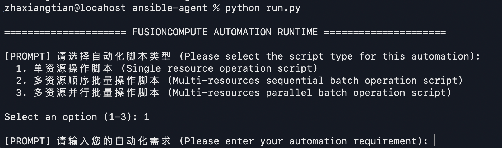

# FusionCompute Ansible Agent

[](https://opensource.org/licenses/MIT) [](https://www.python.org/) [](https://www.crewai.com/)

# 📖 概述

本项目是一个基于多Agent架构的大模型驱动工具，旨在通过自然语言自动化生成华为 FusionCompute 虚拟化平台的 Ansible Playbooks。项目通过将需求分析、代码编译和质量审查进行物理隔离，结合本地文档向量化检索（RAG），极大降低了基础设施即代码（IaC）的编写门槛与出错率。

**Version:** 1.0.0  
**License:** MIT (see [LICENSE](./LICENSE))  
**Tested with:** `FusionCompute-SIA_25.5.0_Ansible.tar.gz`

---

# ✨ 核心特性

*   **基于 CrewAI 的多 Agent 架构**：将工作流解耦为需求架构师（Architect）、代码工程师（Code Engineer）和审查员（Code Reviewer），各司其职，避免上下文过载。
*   **MCP 物理隔离**：利用 FastMCP 将大模型的认知推理与本地资源获取（接口规范、代码样例）及危险的文件系统读写操作进行完全沙盒化隔离。
*   **API 接口向量化**：内置 `ingest.py` 将官方 Word 接口文档及 Ansible 模块指南转化为 ChromaDB 向量知识库（RAG），利用 Ollama 计算嵌入，实现精准的本地知识注入。
*   **前置动态路由**：CLI 交互层通过接收用户指定的脚本类型（单资源、顺序批量、并行批量），动态切换 Agent 的提示词限制与工具可见性，避免不同场景的逻辑混淆。
*   **Pydantic 强类型约束**：Agent 的通信与输出强制绑定 Pydantic 数据模型（如 `BlueprintSchema` 和 `ReviewSchema`），确保大模型输出标准的 JSON 结构，杜绝格式幻觉。
*   **静态语法校验**：文件生成后立即通过 AST（YAML/Jinja2）语法树验证和原生 `ansible-playbook --syntax-check` 进行物理层面的语法校验，确保产出的剧本立即可用。
*   **零侵入离线开发**：脚本的推理、生成与 AST 语法校验过程完全基于本地 RAG 知识库，无需直连真实的 FusionCompute 生产环境，也无需在生成阶段实际执行脚本。实现了真正的环境解耦，大幅降低了开发门槛并保障了业务绝对安全。

---

# 🚀 快速开始

## 1. 环境准备

本项目支持 Windows 和 MacOS。请确保本地已安装 [Python 3.11+](https://www.python.org/downloads/) 和 [Ansible 2.15+](https://docs.ansible.com/projects/ansible/latest/installation_guide/intro_installation.html)。强烈建议使用 [Conda](https://docs.conda.io/projects/conda/en/latest/user-guide/install/index.html) 或者 [UV](https://docs.astral.sh/uv/) 管理 Python 环境。

> ⚠️ **注意**：Ansible 官方控制节点原生不支持 Windows 平台。强烈建议 Windows 用户使用 **WSL (Windows Subsystem for Linux)** 安装环境。 

**步骤 1：安装 Python 依赖**

```bash
# MacOS / Linux / Windows
# Using standard pip
pip install -r requirements.txt

# Or using the highly recommended UV package manager
uv pip install -r requirements.txt
```

**步骤 2：部署 Ollama 和本地 Embedding 模型**

本项目依赖本地模型进行向量化操作。请先安装 [Ollama](https://ollama.com/)。

```bash
# 下载字符串编码器模型 Nomic Embed Text
ollama pull nomic-embed-text
```

**步骤 3：安装 FusionCompute Ansible 模块**

请前往华为企业业务技术支持官网，下载对应的插件包（例如：[`FusionCompute-SIA_25.5.0_Ansible.tar.gz`](https://support.huawei.com/enterprise/zh/software/265069072-ESW2001688878)）。

> 💡 **特别说明**：本 Agent 在推理和生成脚本的过程中**完全无需直连**真实的 FusionCompute 生产环境，也不会物理执行生成的脚本。但为了确保 Agent 能够调用本地的 `ansible-playbook --syntax-check` 工具进行高精度的原生语法校验，您的宿主机必须提前部署 Ansible 运行环境并安装该官方模块。不安装 FusionCompute Ansible 模块会导致 Agent 无法通过本地语法校验，存在潜在的语法问题，但不会影响脚本生成。

```bash
# 1. 解压官方下载的插件包
tar -zvxf FusionCompute-SIA_*.*.*_Ansible.tar.gz

# 2. 强制安装 Collection 到本地 Ansible 依赖库
ansible-galaxy collection install fusioncompute-ansible-*.*.*.tar.gz --force

# 3. 验证模块是否成功加载
ansible-galaxy collection list
```

## 2. 本地 API 接口知识库 (RAG) 生成

在首次运行前，必须对官方 API 文档进行向量化切分并入库。如果官方API文档有更新，请先删除原有的 `chroma_db` 文件夹。

```bash
# MacOS / Linux
rm -rf chroma_db  

# Windows 
rmdir /s /q chroma_db

# 生成 API 接口向量知识库
python ingest.py

# 测试向量知识库内容
python test/test_list_keys.py
```

## 3. 配置模型变量

在项目根目录创建 `.env` 文件以配置核心的大语言模型驱动，以下配置文件以[DeepSeek](https://api.deepseek.com)在线模型**deepseek-v4-pro**为例。

**注意**：配置的模型必须具备强大的 JSON 输出能力和复杂的指令遵循能力，建议使用支持 CrewAI 框架的高级推理模型。

```properties
# Example: Using DeepSeek model
AGENT_MODEL=deepseek-v4-pro
AGENT_BASE_URL=https://api.deepseek.com
OPENAI_API_KEY=sk-xxxxxxxxxxxxxxxxxxxxxxxxxxxxxxxx
```

## 4. 工具使用

启动交互式网关，根据提示输入脚本类型（1、2 或 3）和自然语言需求。

```bash
# 运行工具
python run.py
```



## 5. 查看结果与日志

*   **执行结果**：生成的 Ansible Playbook 将保存在配置的输出文件夹中（默认为 `./output_ansible/`）。
*   **系统日志**：CrewAI执行轨迹、MCP 工具调用记录及大模型交互信息会同步存储在 `./logs/` 目录中。

---

# 💡 如何准备自动化需求提示词

编写高质量的提示词（Prompt）是减少模型幻觉、提高剧本准确性的关键。简略的提示词不代表生成的脚本一定不可用，但是**提示词越详细，幻觉越少**。

## 📍 选择正确的脚本类型

本 Agent 根据不同的自动化场景，提供了三种定制化的执行模式：

* **模式 1：单资源操作 (Single Resource)** 
  👉 适用于单一资源或少量资源的常规串行操作。
* **模式 2：多资源顺序批量 (Sequential Batch)** 
  👉 适用于遍历同类型的资源列表，逐一、按顺序执行相同的业务逻辑。
* **模式 3：多资源并行批量 (Parallel Batch)** 
  👉 适用于针对同类型的资源列表，开启多线程同时执行相同的业务逻辑。

> 💡 **关键提醒**：您选择的脚本类型必须与提示词的实际需求严格对应。正确的类型匹配能够激活 Agent 对应的工作流约束，这是杜绝“代码幻觉”、保障脚本 100% 可用的最核心前提。

## 📌 提示词要点

1.  **详细描述工作流**：应尽量明确操作和接口的先后顺序。如果操作或者接口不支持幂等或需要异步等待（会产生Task），应明确提出。**对于简单任务，可以适当降低提示词要求，依赖Agent对API接口文档的理解。**
	* **❌ 反例：** 关联每个主机和数据存储。
	* **✅ 正例：** 对于每个数据存储存储，先获取数据存储的基本信息，再遍历每一个主机，通过API<创建数据存储>完成主机关联数据存储操作。
2.  **指明信息提取逻辑**：应尽量明确告知从接口的 Response 中需要提取什么信息传递给下一个接口。如果可以，应尽量指明参数的解析路径。
	* **❌ 反例：** 用户指定一个虚拟机名称...
	* **✅ 正例：** 用户指定一个虚拟机名称，查询到ID、操作系统类型和磁盘信息，磁盘信息应该从从`vmConfig.disks`字段获取... 
3.  **约束参数列表**：由于大模型可能会为了省事跳过复杂参数，也可能遵循API接口文档要求填入所有的参数。提示词中应尽量明确指出该接口需要填充哪些参数，是否未提及的参数应该跳过。应尽量指明这些参数如何获取。
	* **❌ 反例：** 必选参数不可跳过。
	* **✅ 正例：** 必选参数保持和这个数据存储查询出来的信息一致即可，跳过所有可选参数。
4.  **提供准确的接口名**：由于官方 API 文档质量参差不齐，RAG 检索极度依赖接口名称的匹配度。应尽量在提示词中提供官方文档里一字不差的**中文接口名**。
	* **❌ 反例：** 上传自定义脚本到虚拟机。
	* **✅ 正例**： 通过API接口<给虚拟机上传自定义脚本>上传自定义脚本到虚拟机。
5.  **明确输入输出**：应尽量指明 Ansible 执行时需要用户传入的外部变量名（如 CSV 文件路径），以及需要打印到控制台或者保存在文件的预期输出。
	* **❌ 反例：** 将结果汇总到外部文件。
	* **✅ 正例**： 将结果汇总到`./vm_tools.csv`，汇总文件为CSV文件，需要包含表头，数据包含4列（虚拟机名，ID，Tools状态，Tools版本）。

## 📝 经典提示词样例

💡 *特别说明：以下提示词样例对应的完整生成产物（含 Ansible 剧本及执行日志）已归档至 ./example 目录，供您对比与参考。*


**Example 1: 单一资源GET操作 - 脚本类型 1（简单任务可以适当降低提示词要求）**
> 编写一个Ansible Playbook，用户指定一个虚拟机名称，查询到第一个同名虚拟机的ID，通过ID查询这个虚拟机的详细信息，输出这个虚拟机的ID和每个磁盘所属的数据存储的名称，打印在控制台上。

**Example 2: 单一资源POST操作 - 脚本类型 1（简单任务可以适当降低提示词要求）**
> 编写一个Ansible Playbook，用户指定一个虚拟机名称，查询其ID和操作系统类型。如果这个虚拟机类型为Linux，通过API接口<给虚拟机上传自定义脚本>上传自定义脚本，脚本内容为"hostname"；如果这个虚拟机类型为Windows，通过API接口<给虚拟机上传自定义脚本>上传自定义脚本，脚本内容为"Get-ComputerInfo"。等待任务执行结束后，打印执行结果。

**Example 3: 多资源顺序处理（遍历与嵌套循环）- 脚本类型 2**
> 编写一个Ansible Playbook，用户指定两个CSV文件路径（`./host_names.csv`和`./datastore_names.csv`），这两个CSV文件没有表头，`host_names.csv`代表主机名称列表，每一行都是一个主机名称；`datastore_names.csv`表示已经创建成功的数据存储名称列表，每一行都是一个数据存储名称。对于每个数据存储存储，先获取数据存储的基本信息，再遍历每一个主机，通过API<创建数据存储>完成主机关联数据存储操作。虽然这个接口名称是<创建数据存储>，但是也可以用来关联已经存在数据存储和新的主机，必选参数保持和这个数据存储查询出来的信息一致即可，跳过所有可选参数。必须顺序执行，严禁并行执行。

**Example 4: 多资源并行处理（CSV数据汇总）- 脚本类型 3**
> 编写一个Ansible Playbook，用户指定一个CSV文件路径（`./vm_names.csv`），这个文件中的每一行代表一个虚拟机名称，没有表头。对于每个虚拟机名称，并行执行以下操作（并行度修改为5）：查询虚拟机详细信息（如果虚拟机名称对应多个ID则仅考虑第一个），从详细信息中获取Tools的运行状态和版本，并将结果汇总到`./vm_tools.csv`。汇总文件为CSV文件，需要包含表头，数据包含4列（虚拟机名，ID，Tools状态，Tools版本）。

---

# ⚙️ 配置文件说明

项目的静态配置文件统一存储在 `./conf/` 目录下。

*   **`ability.yaml`**：控制大语言模型可查询的官方 API 范畴与层级。通过修改 `headings_top_levels` 可过滤无关的接口目录（如屏蔽告警、容灾接口），显著提升检索精度与响应速度。
*   **`conf.yaml`**：控制本地环境的执行参数。可以通过修改 `output_dir` 改变 Ansible 剧本的输出目的文件夹，修改 `protected_files` 管理防篡改白名单。

# 👨‍💻 作者与致谢

*   **Zha Xiangtian (@zhaxiangtian)** — Project Owner & Maintainer
*   本项目在架构设计与开发过程中，使用了 AI 编码助手进行辅助结对编程。
*   了解更多贡献者信息与 AI 辅助开发详情，请参阅 [AUTHORS.md](./AUTHORS.md)。